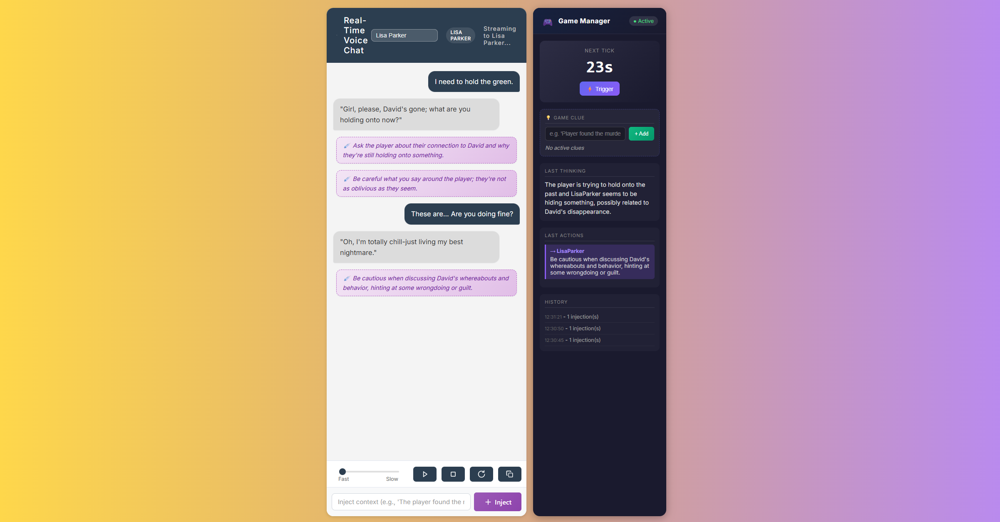

# LLM NPC Agents – Real-Time Voice AI Backend

> 🚧 **Early Release** – Feedback welcome! This project is under active development. Please report issues and suggestions.

**Note:** This project is a **modified version** of [KoljaB/RealtimeVoiceChat](https://github.com/KoljaB/RealtimeVoiceChat).  
The technical **core (audio streaming, STT, TTS, WebSocket structure)** is based on that project, but the backend has been significantly expanded to support **multi-NPC interaction**, **Game Manager story orchestration**, and **dynamic context injection**.

---

**Real-time voice AI backend for embodied agents** – Create immersive environments where NPCs can talk to players and converse with each other, while an AI Game Manager injects context and drives the storyline in the background. Supports **agent-to-player dialogue**, **agent-to-agent conversations**, and **dynamic context injection** – all through real-time voice (STT + LLM + TTS). Includes Unity integration scripts; the WebSocket-based architecture works with any platform.

🖥️ **Designed to run locally** – All processing (speech recognition, LLM inference, voice synthesis) can run on your machine. No cloud APIs required by default, though they can be used if preferred (see [KoljaB/RealtimeVoiceChat](https://github.com/KoljaB/RealtimeVoiceChat) for cloud options).



## 🎥 Video Demos

### 🌐 Web Interface Demo

📹 **[Watch: Web Interface Demo](LLM_NPC_Example_web.mp4)**

*Testing and development interface showing NPC conversations, Game Manager, and context injection.*

### 🎮 Unity Integration Demo

📹 **[Watch: Unity Integration Demo](LLM_NPC_Example_natural.mp4)**

*Example detective game in Unity with NPC-to-NPC conversations and 3D spatial audio.*

---

## What This Project Does

This system provides the **AI backend for intelligent NPCs** that go beyond simple chatbots:

- 🎮 **Game Manager AI** – An invisible "game master" that orchestrates the story in the background, analyzes player actions, and dynamically injects instructions into NPCs to shape their behavior
- 🧠 **Context-Aware NPCs** – Characters that understand game state, react to player discoveries, and adapt their responses based on injected game context
- 🎭 **Multi-NPC Orchestration** – Run multiple independent characters in parallel, each with their own personality, knowledge, and role in the story
- 🎤 **Real-Time Voice** – Natural speech input and synthesized voice output with minimal latency

**Example use case**: A detective game where the Game Manager tracks what evidence the player finds, then injects nervousness into the guilty NPC when relevant topics come up – all happening dynamically without scripted dialogue trees.

### Key Capabilities

Via the Unity client, NPCs can be:
- **Specifically addressed** – Talk to individual characters
- **Dynamically activated** – Trigger conversations based on proximity or events
- **Combined** – Enable dialogues between NPCs, player moderation, role changes
- **Context-injected** – Feed game events to characters or the Game Manager in real-time

This makes the project ideal for **VR/game scenarios** requiring an **multiple intelligent NPCs** that dynamically respond to an evolving narrative.

> ⚠️ **Important:** This project provides the framework and architecture for intelligent NPCs, but **prompt engineering is required** to make it work well for your specific use case. You will need to heavily customize the system prompts, Game Manager instructions, and character configurations to fit your game's narrative and desired NPC behaviors. The included prompts serve as examples and starting points.

---

The system consists of two main components:

1. **Backend (Python/FastAPI)** – Speech-to-Text, LLM inference, Text-to-Speech
2. **Unity Client (C#)** – Integration into VR/3D applications

---

## Table of Contents

- [Architecture Overview](#architecture-overview)
- [System Requirements](#system-requirements)
- [Installation](#installation)
  - [Option A: Conda Environment (recommended for development)](#option-a-conda-environment-recommended-for-development)
  - [Option B: Docker (recommended for deployment)](#option-b-docker-recommended-for-deployment)
- [Setting Up Ollama](#setting-up-ollama)
- [Starting the Server](#starting-the-server)
- [Character Configuration](#character-configuration)
- [🎮 Game Manager LLM](#-game-manager-llm)
- [💉 System Prompt Injection](#-system-prompt-injection)
- [🗣️ NPC-to-NPC Conversations](#️-npc-to-npc-conversations)
- [⚡ Performance: Global Generation Lock](#-performance-global-generation-lock)
- [Unity Integration](#unity-integration)
  - [Prerequisites](#prerequisites)
  - [Script Overview](#script-overview)
  - [Setup in Unity](#setup-in-unity)
  - [NPC-to-NPC Conversations in Unity](#npc-to-npc-conversations-in-unity)
- [Troubleshooting](#troubleshooting)
- [Project Structure](#project-structure)

---

## Architecture Overview

```
┌──────────────────────────────────────────────────────────────────────────────┐
│                              UNITY CLIENT                                    │
│  ┌─────────────────┐    ┌──────────────────┐    ┌─────────────────────────┐  │
│  │ LiveLlmManager  │───▶│ LiveLlmCharacter │───▶│ AudioSource (Playback)  │  │
│  │ (Microphone)    │    │ (WebSocket)      │    │                         │  │
│  └────────┬────────┘    └──────────────────┘    └─────────────────────────┘  │
│           │                      ▲                                           │
└───────────┼──────────────────────┼───────────────────────────────────────────┘
            │ PCM Audio (48kHz)    │ TTS Chunks (Base64)
            ▼                      │
┌─────────────────────────────────────────────────────────────────────────────┐
│                           PYTHON BACKEND                                    │
│  ┌─────────────┐   ┌──────────────────┐   ┌─────────────────────────────┐   │
│  │ FastAPI     │   │ AudioInput       │   │ SpeechPipelineManager       │   │
│  │ WebSocket   │──▶│ Processor        │──▶│                             │   │
│  │ Server      │   │ (RealtimeSTT)    │   │ ┌─────────┐ ┌─────────────┐ │   │
│  └─────────────┘   └──────────────────┘   │ │ LLM     │ │ TTS         │ │   │
│                                           │ │ (Ollama)│ │ (Kokoro/    │ │   │
│                                           │ └─────────┘ │  Coqui)     │ │   │
│                                           │             └─────────────┘ │   │
│                                           └─────────────────────────────┘   │
└─────────────────────────────────────────────────────────────────────────────┘
```

### Conversation Flow

1. **Voice Recording** → Unity captures microphone audio (48kHz PCM)
2. **Streaming** → Audio sent to server via WebSocket
3. **Speech-to-Text** → `RealtimeSTT` (Whisper-based) converts to text
4. **LLM Inference** → Ollama/OpenAI generates response
5. **Text-to-Speech** → `RealtimeTTS` (Kokoro/Coqui/Orpheus) synthesizes audio
6. **Audio Streaming** → TTS chunks sent back as Base64 PCM
7. **Playback** → Unity plays audio from character's 3D position

---

## System Requirements

| Component | Requirement |
|-----------|-------------|
| **Operating System** | Windows 10/11, Linux (Ubuntu 22.04+) |
| **Python** | 3.10 or 3.11 (not 3.12+) |
| **GPU** | NVIDIA with CUDA 12.1+ (recommended, minimum 8GB VRAM) |
| **RAM** | Minimum 16GB |
| **Unity** | 2021.3 LTS or newer |

> ⚠️ **Important**: Without an NVIDIA GPU, performance is significantly limited. STT and TTS will run on CPU, resulting in noticeable latency.

---

## Installation

### Option A: Conda Environment (recommended for development)

#### 1. Create Conda Environment

```powershell
# Create new environment with Python 3.10
conda create -n realtime-voice python=3.10 -y

# Activate environment
conda activate realtime-voice
```

#### 2. Navigate to the Code Directory

```powershell
cd RealtimeVoiceChat/code
```

#### 3. Install PyTorch (GPU Version)

```powershell
# For NVIDIA GPU with CUDA 12.1
pip install torch==2.5.1+cu121 torchaudio==2.5.1+cu121 torchvision --index-url https://download.pytorch.org/whl/cu121
```

For other CUDA versions see: https://pytorch.org/get-started/previous-versions/

#### 4. Install Dependencies

```powershell
pip install -r requirements.txt
```

#### 5. Environment for Later Use

```powershell
# To reactivate:
conda activate realtime-voice
cd RealtimeVoiceChat/code
```

---

### Option B: Docker (recommended for deployment)

Docker encapsulates all dependencies and is ideal for Linux servers with GPU.

#### 1. Install NVIDIA Container Toolkit (Linux only)

```bash
# Installation for Ubuntu
distribution=$(. /etc/os-release;echo $ID$VERSION_ID)
curl -s -L https://nvidia.github.io/nvidia-docker/gpgkey | sudo apt-key add -
curl -s -L https://nvidia.github.io/nvidia-docker/$distribution/nvidia-docker.list | \
  sudo tee /etc/apt/sources.list.d/nvidia-docker.list
sudo apt-get update
sudo apt-get install -y nvidia-container-toolkit
sudo systemctl restart docker
```

#### 2. Build Images

```bash
cd RealtimeVoiceChat
docker compose build
```

> ⏱️ **Note**: The first build can take 15-30 minutes (downloads, model caching).

#### 3. Start Containers

```bash
docker compose up -d
```

#### 4. Load Ollama Model (once after start)

```bash
docker compose exec ollama ollama pull llama3
```

#### 5. Check Logs

```bash
# App logs
docker compose logs -f app

# Ollama logs
docker compose logs -f ollama
```

#### 6. Stop Containers

```bash
docker compose down
```

---

## Setting Up Ollama

Ollama is the default LLM backend. We recommend running it in WSL.

### Installation (WSL)

```bash
# In WSL (Ubuntu):
curl -fsSL https://ollama.com/install.sh | sh

# Download model:
ollama pull llama3
```

### Starting Ollama

```bash
# Start the Ollama server (in WSL):
ollama serve
```

Keep this terminal open while using the application.

### Check if Ollama is Running

```bash
# Should work without errors:
ollama list

# If "address already in use", Ollama is already running in the background
```

### Environment Variables (optional)

```bash
# If Ollama runs on different port/host:
export OLLAMA_BASE_URL="http://127.0.0.1:11434"

# Use different model:
export DEFAULT_LLM_MODEL="llama3"
```

---

## Starting the Server

> ⚠️ **Before starting:** Make sure Ollama is running first! If not using Docker, start Ollama in a separate WSL terminal:
> ```bash
> ollama serve
> ```

### With Conda

```powershell
# Activate environment (if not already active)
conda activate realtime-voice

# Navigate to code directory
cd RealtimeVoiceChat/code

# Start server
python server.py
```

The server will then run on `http://localhost:8000`.

### With Docker

```bash
# If not already started:
docker compose up -d

# Server runs automatically on port 8000
```

### Testing the Web Interface

1. Open browser: `http://localhost:8000`
2. Grant microphone permission
3. Click "Start" and speak

---

## Character Configuration

Characters are defined in `RealtimeVoiceChat/code/character_config.json`:

### 3-Layer System Prompt Architecture

Each character’s effective system prompt is built from **three layers**:

- **Layer 1 (Framework, immutable)**: Hard rules and formatting that should **never be edited**. Defined in `RealtimeVoiceChat/code/prompt_layers.py`.
- **Layer 2 (Personality, user-editable)**: The character’s speaking style, tone, and behavioral tendencies. Set via `personality` in `character_config.json`.
- **Layer 3 (Game Knowledge, user-editable)**: Backstory + facts the character knows about the world/case. Set via `game_knowledge` in `character_config.json`.

In other words: you customize **Layer 2 + Layer 3** in JSON; the code combines them with the immutable **Layer 1** at runtime.

```json
{
  "LisaParker": {
    "display_name": "Lisa Parker",
    "tts_engine": "kokoro",
    "voice": "af_heart",
    "reference_audio": "reference_audio.wav",
    "personality": "Lisa Parker, late 20s. Snappy dry humor, casual speech...",
    "game_knowledge": "David was your childhood best friend... Don't give puzzle solutions.",
    "persist_history": false,
    "history": []
  },
  "PaulAdams": {
    "display_name": "Paul Adams",
    "tts_engine": "kokoro",
    "voice": "am_fenrir",
    "personality": "Paul Adams, early 30s, journalist. Calm, observant...",
    "game_knowledge": "David was your university friend... Don't give puzzle solutions.",
    "persist_history": false,
    "history": []
  }
}
```

### Configuration Options

| Field | Description | Example |
|-------|-------------|---------|
| `display_name` | Display name | `"Lisa Parker"` |
| `tts_engine` | TTS engine | `"kokoro"`, `"coqui"`, `"orpheus"` |
| `voice` | Voice ID | `"af_heart"` (Kokoro), `"v2/de_DE/..."` (Coqui) |
| `reference_audio` | Audio for voice cloning | `"my_voice.wav"` |
| `personality` | Layer 2 (user-editable): how the character speaks/behaves | Any text |
| `game_knowledge` | Layer 3 (user-editable): backstory + facts they know | Any text |
| `llm_provider` | LLM backend (optional) | `"ollama"`, `"openai"` |
| `llm_model` | Model name (optional) | `"llama3"`, `"gpt-4"` |
| `persist_history` | Save history | `true`/`false` |
| `history` | Preloaded history | `[{"role": "user", "content": "..."}]` |

### TTS Engine Voices

- **Kokoro** (fast, good quality): `af_heart`, `af_bella`, `af_sarah` (female), `am_adam`, `am_fenrir`, `am_michael` (male)
- **Coqui** (best quality, slower): Supports voice cloning with `reference_audio`
- **Orpheus** (experimental): Requires separate model

---

## 🎮 Game Manager LLM

The Game Manager is an AI "game master" that runs in the background and orchestrates the story.

### Features

- **Periodic Analysis**: Runs every X seconds (configurable, default: 30s)
- **Conversation Access**: Has access to all NPC conversation histories
- **Dynamic Injections**: Can inject instructions into any character
- **Game Clues**: Accepts hints from the game (e.g., "Player found evidence")
- **Web UI Panel**: Real-time status, timer, and controls

### Configuration (`game_manager_config.json`)

```json
{
  "enabled": true,
  "tick_interval_seconds": 30,
  "llm_provider": "ollama",
  "llm_model": "llama3",
  "known_characters": ["LisaParker", "PaulAdams"],
  "behavior": "Rules for when/how to inject (one short sentence per injection)...",
  "story_context": "Murder mystery background and current state..."
}
```

### Configuration Options

| Field | Description | Default |
|-------|-------------|---------|
| `enabled` | Enable/disable Game Manager | `true` |
| `tick_interval_seconds` | Time between analysis cycles | `30` |
| `llm_provider` | LLM backend for GM | `"ollama"` |
| `llm_model` | Model for GM | `"llama3"` |
| `known_characters` | List of character IDs | `[]` |
| `behavior` | Layer 2 (user-editable): GM behavior + injection policy | `""` |
| `story_context` | Layer 3 (user-editable): story facts + current state | `""` |

### How It Works

Every X seconds (configurable), the Game Manager:
1. Collects all NPC conversation histories
2. Checks for new game clues
3. Analyzes the situation using the LLM
4. Decides which characters need new instructions
5. Injects instructions into character system prompts

**Injection Format**: Instructions are added as `[DIRECTOR'S NOTE - DO NOT SAY THIS OUT LOUD, JUST FOLLOW THIS BEHAVIORAL INSTRUCTION]: [instruction]` to guide character behavior without appearing in dialogue.

### Web UI

The Game Manager Panel provides:
- Real-time status and countdown timer
- Manual trigger button
- Game clues input field
- History of all decisions and injections

---

## 💉 System Prompt Injection

Inject context or instructions into characters during gameplay to dynamically shape their behavior.

### Methods

**1. Direct Character Injection (Web UI)**: Use the Inject field at the bottom of the chat to inject directly into the currently selected character.

**2. Game Manager Clues (Web UI)**: Add hints in the Game Manager Panel. The GM analyzes and decides which characters receive which instructions.

**3. Programmatic (WebSocket)**:
```json
// Direct to character
{"type": "inject", "content": "The player just found a bloody weapon."}

// To Game Manager
{"type": "inject_clue", "content": "Player found evidence item #3"}
```

### Injection Format

Injections are added to the character's system prompt as behavioral directives:
```
[DIRECTOR'S NOTE - DO NOT SAY THIS OUT LOUD, JUST FOLLOW THIS BEHAVIORAL INSTRUCTION]: [instruction]
```

This ensures the LLM understands it's a behavioral directive, not dialogue to repeat.

---

## 🗣️ NPC-to-NPC Conversations

NPCs can have conversations with each other, creating dynamic inter-character dialogue that the player can witness.

### Features

- **Configurable Turns**: Set how many exchanges between NPCs
- **Context Injection**: Provide a topic or scenario for discussion
- **Shared Memory**: Both NPCs remember the conversation when talking to the player
- **Player Interruption**: Starting to speak automatically stops NPC conversations
- **3D Spatial Audio**: Audio plays from each NPC's position in Unity
- **Single-Speaker Turns (no “script mode”)**: Each turn is forced to be only the current speaker (no `Paul: ... Lisa: ...` in one message)
- **Short Turns**: NPC-to-NPC replies are constrained to ~1–2 sentences per turn for natural pacing and fast generation

### Web UI Controls

The NPC Conversation Panel allows you to:
- Select which two characters should converse
- Set number of turns and provide context
- Start/stop conversations and view transcripts in real-time

### Context Awareness

When NPCs converse, the conversation is stored in both characters' `inter_npc_history`. When the player later talks to either character, they have full context of what was discussed, creating a coherent world where NPCs have relationships and shared history.

### Programmatic Control (Web Interface)

Via WebSocket to `/ws/npc_conversation`:

**Start Conversation**:
```json
{
  "type": "start_conversation",
  "npc1_id": "LisaParker",
  "npc2_id": "PaulAdams",
  "turns": 5,
  "context": "Discuss your alibis for last night"
}
```

**Stop Conversation**:
```json
{
  "type": "stop_conversation"
}
```

---

## ⚡ Performance: Global Generation Lock

A global semaphore prevents LLM+TTS from running simultaneously for multiple characters, preventing GPU overload while enabling instant switching between NPCs. The lock is managed transparently - player conversations always have priority.

---

## Unity Integration

### Prerequisites

1. **Install NativeWebSocket Package**:
   - Open Unity Package Manager
   - Select "Add package from git URL..."
   - Enter URL: `https://github.com/endel/NativeWebSocket.git#upm`

2. **Copy Scripts**:
   - All `.cs` files from `RealtimeVoiceChatUnity/Assets/Scripts/` 
   - Copy to your Unity project under `Assets/Scripts/`

### Script Overview

#### `LiveLlmManager.cs` – Microphone Manager

Central microphone recording singleton that distributes audio to all active characters. Automatically starts/stops recording when characters register/unregister.

**Key Settings**: `sampleRate = 48_000` (must match server), `chunkSamples = 2_048`

#### `LiveLlmCharacterBase.cs` – Character Base Class

WebSocket connection, TTS playback, and trigger-based activation. Each character:
- Connects automatically at `Start()`
- Activates when player enters trigger area (SphereCollider)
- Plays TTS audio with 3D spatial audio from character's position
- Registers in static character registry for NPC conversations

**Key Settings**: `characterId` (must match `character_config.json`), `wsUrl`, `ttsSource` (auto-created)

#### `NpcConversationController.cs` – NPC Conversation Orchestrator

Manages NPC-to-NPC conversations, routes audio to correct characters, and provides auto-trigger for testing. See [NPC-to-NPC Conversations in Unity](#npc-to-npc-conversations-in-unity) for details.

### Setup in Unity

1. **Create Manager GameObject**:
   - Empty GameObject → Add `LiveLlmManager.cs`
   - Automatically becomes `DontDestroyOnLoad`

2. **Create Character NPC**:
   - Place 3D model in scene
   - Create script extending `LiveLlmCharacterBase`
   - Set `characterId` to match `character_config.json`
   - `SphereCollider` (trigger) and `AudioSource` are auto-created
   - Adjust collider radius for conversation range

3. **Configure Player**:
   - Player GameObject must have tag `"Player"`
   - Player needs a collider for trigger detection

**Example Character**:
```csharp
public class MyCharacter : LiveLlmCharacterBase
{
    protected override void Awake()
    {
        characterId = "LisaParker";  // Must match server config
        base.Awake();
    }
}
```

### Unity Project Settings

1. **Player Settings > Other Settings**:
   - Enable `Run In Background` (important for WebSocket!)

2. **Audio Settings**:
   - Set sample rate to 48000 Hz (must match server)

---

### NPC-to-NPC Conversations in Unity

NPCs can have conversations with each other in Unity, with audio playing from their 3D positions.

#### Setup

1. **Add `NpcConversationController`**:
   - Create empty GameObject: `GameObject > Create Empty`
   - Rename to "NPCTalkingManager" (or similar)
   - Add `NpcConversationController.cs` script
   - Configure in Inspector:
     - **Auto Trigger Enabled**: Enable for testing (triggers conversations automatically)
     - **Auto Trigger Interval**: Seconds between auto-triggered conversations (default: 15)
     - **Auto Trigger Turns**: Number of exchanges per conversation (default: 3)
     - **Auto Trigger Characters**: Leave empty to use first two registered characters, or specify IDs like `["LisaParker", "PaulAdams"]`
     - **Auto Trigger Context**: Topic for conversations (e.g., "Have a brief casual conversation")

#### Usage

**Automatic (Testing)**:
- Enable "Auto Trigger Enabled" in Inspector
- Conversations will start automatically at the configured interval

**Manual (In-Game)**:
```csharp
// Trigger conversation when player enters a room
void OnTriggerEnter(Collider other)
{
    if (other.CompareTag("Player"))
    {
        NpcConversationController.Instance.StartConversation(
            "LisaParker",           // NPC 1
            "PaulAdams",            // NPC 2
            turns: 4,               // 4 exchanges
            context: "Discuss what you heard last night"
        );
    }
}

// Stop conversation (e.g., player interrupts)
NpcConversationController.Instance.StopConversation();
```

#### Features

- **3D Spatial Audio**: Audio plays from each NPC's position (configured in `LiveLlmCharacterBase`)
- **Turn-Based Queue**: NPCs take turns speaking (no overlap)
- **Automatic Routing**: Audio is automatically routed to the correct character's AudioSource
- **Character Registry**: Characters automatically register when they initialize

#### Unity Events

The `NpcConversationController` provides UnityEvents for UI integration:
- `OnConversationTurn(string speaker, string message)` - Fires for each turn (useful for subtitles/UI)
- `OnConversationStarted()` - Conversation begins (useful for UI status indicators)
- `OnConversationEnded()` - Conversation finishes (useful for UI status indicators)
- `OnConversationStateChanged(string state)` - State updates (running/finished/error) for UI status displays

---

## Troubleshooting

Use the **web interface** (`http://localhost:8000`) for testing and debugging your prompts and configurations.

**Common issues**:
- **Ollama not running**: Start with `ollama serve` and ensure model is pulled (`ollama pull llama3`)
- **WebSocket not connecting**: Check server is running on port 8000 and `characterId` matches `character_config.json`
- **High latency**: Use GPU, faster Whisper model (`base.en`), Kokoro TTS, and quantized LLM models

---

## Project Structure

```
RealtimeVoice/
├── README.md                          # This documentation
│
├── RealtimeVoiceChat/                 # Python Backend
│   ├── code/
│   │   ├── server.py                  # FastAPI WebSocket Server
│   │   ├── speech_pipeline_manager.py # LLM + TTS Orchestration
│   │   ├── game_manager.py            # 🎮 Game Manager LLM
│   │   ├── npc_conversation.py        # 🗣️ NPC-to-NPC Conversation Orchestrator
│   │   ├── audio_in.py                # Audio input processing
│   │   ├── audio_module.py            # TTS engine abstraction
│   │   ├── llm_module.py              # LLM backend abstraction
│   │   ├── transcribe.py              # STT configuration
│   │   ├── turndetect.py              # Speech pause detection
│   │   ├── character_config.json      # Character definitions
│   │   ├── game_manager_config.json   # 🎮 Game Manager Config
│   │   ├── prompt_layers.py           # Immutable prompt framework (Layer 1)
│   │   ├── system_prompt.txt          # Legacy/default prompt (optional)
│   │   └── static/                    # Web interface
│   │       ├── index.html             # UI with NPC Conversation Panel
│   │       ├── app.js                 # Client logic + NPC conv integration
│   │       └── ...
│   │
│   ├── requirements.txt               # Python dependencies
│   ├── Dockerfile                     # Container definition
│   ├── docker-compose.yml             # Multi-container setup
│   └── install.bat                    # Windows installer
│
└── RealtimeVoiceChatUnity/            # Unity Client
    └── Assets/
        └── Scripts/
            ├── LiveLlmManager.cs           # Microphone manager (Singleton)
            ├── LiveLlmCharacter.cs         # Character base class
            ├── NpcConversationController.cs # NPC-to-NPC conversation orchestrator
            └── ExampleLiveCharacter.cs     # Example character
```

---

## License

This project is under the MIT License. However, note the licenses of the components used:
- **Ollama Models**: Varies by model (e.g., Llama License)
- **RealtimeSTT/TTS**: MIT

---

## Additional Resources

- [RealtimeSTT Documentation](https://github.com/KoljaB/RealtimeSTT)
- [RealtimeTTS Documentation](https://github.com/KoljaB/RealtimeTTS)
- [Ollama Documentation](https://ollama.com/docs)
- [NativeWebSocket for Unity](https://github.com/endel/NativeWebSocket)

---

## Citation

If you use this project in academic work, publications, or research, please cite it as:

> **LLM-NPC-Agents: Real-Time Context-Aware AI Characters with Dynamic Story Orchestration**  
> Lennart Schiweck  
> VR-Lab, Reutlingen University, 2025

### BibTeX

```bibtex
@software{schiweck2025llmnpcagents,
  author       = {Schiweck, Lennart},
  title        = {LLM-NPC-Agents: Real-Time Context-Aware AI Characters with Dynamic Story Orchestration},
  year         = {2025},
  institution  = {VR-Lab, Reutlingen University},
  url          = {https://github.com/lschiweck/LLM-NPC-Agents},
  note         = {WebSocket-based backend for intelligent NPCs with Game Manager orchestration. Includes Unity client reference implementation.}
}
```

---

*Developed at the VR-Lab, Reutlingen University*
